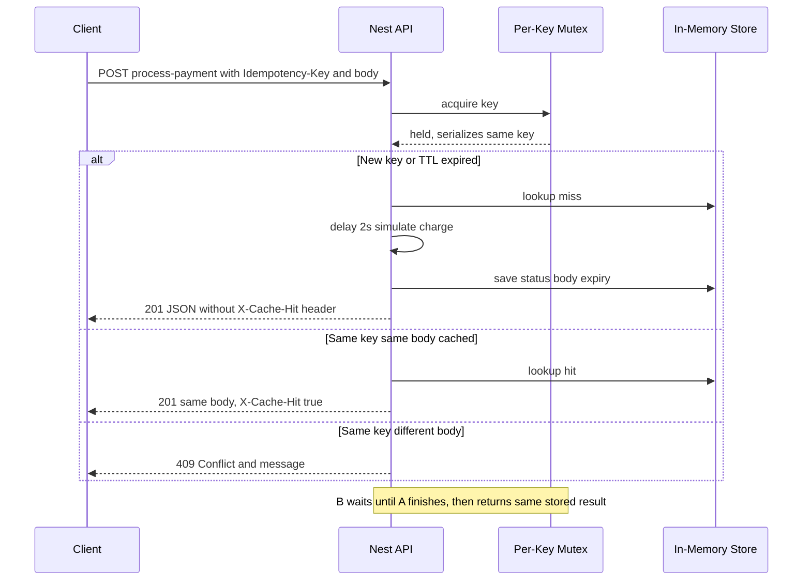

# Idempotency Gateway

NestJS service that processes `POST /process-payment` **at most once** per `Idempotency-Key` + body pair, with safe retries and concurrent-request handling.

## Architecture



## Setup

```bash
cd backend/Idempotency-gateway
npm ci
npm start
```

- **API:** `http://localhost:3000` (override with `PORT`)
- **Swagger:** `http://localhost:3000/docs`

## API

**Base URL (local):** `http://localhost:3000`  
**Interactive docs:** `GET /docs` (Swagger UI)

### Endpoints

| # | Method | Path | Purpose |
|---|--------|------|---------|
| 1 | `POST` | `/process-payment` | Simulate a charge; idempotent per `Idempotency-Key` + body |
| 2 | `GET` | `/docs` | Swagger (optional, for manual testing) |

### Headers (`POST /process-payment`)

| Header | Required | Description |
|--------|----------|-------------|
| `Idempotency-Key` | Yes | Unique string for this logical operation (retries must reuse it) |
| `Content-Type` | Yes | `application/json` |

### Request body (`POST /process-payment`)

| Field | Type | Rules |
|-------|------|--------|
| `amount` | integer | ≥ 1 |
| `currency` | string | Exactly 3 letters (normalized to uppercase, e.g. `ghs` → `GHS`) |

### Responses (what to expect)

| Case | HTTP | Response body (shape) | Response headers |
|------|------|------------------------|-------------------|
| First charge for key + body | `201` | `{"message":"Charged 100 GHS","amount":100,"currency":"GHS"}` | no `X-Cache-Hit` |
| Same key + same JSON again | `201` | **Identical** JSON to first success | `X-Cache-Hit: true` |
| Same key + different JSON | `409` | Nest error JSON; `message` = `Idempotency key already used for a different request body.` | — |
| Missing `Idempotency-Key` | `400` | `message` explains missing header | — |
| Invalid body (e.g. amount 0) | `400` | class-validator error payload | — |

**Timing:** first charge waits **~2 seconds** (simulated processing). Cached replay returns immediately (no second delay).

### Example requests (`curl`)

Replace `demo-key-1` with your own key per test run.

**1  First charge (happy path, ~2s)**

```bash
curl -sS -D - -X POST http://localhost:3000/process-payment \
  -H 'Content-Type: application/json' \
  -H 'Idempotency-Key: demo-key-1' \
  --data '{"amount":100,"currency":"GHS"}'
```

**2  Safe retry (same key + same body, fast; check `X-Cache-Hit: true`)**

```bash
curl -sS -D - -X POST http://localhost:3000/process-payment \
  -H 'Content-Type: application/json' \
  -H 'Idempotency-Key: demo-key-1' \
  --data '{"amount":100,"currency":"GHS"}'
```

**3  Fraud / mismatch (same key, different amount)**

```bash
curl -sS -D - -X POST http://localhost:3000/process-payment \
  -H 'Content-Type: application/json' \
  -H 'Idempotency-Key: demo-key-1' \
  --data '{"amount":500,"currency":"GHS"}'
```

**4  Missing idempotency key**

```bash
curl -sS -D - -X POST http://localhost:3000/process-payment \
  -H 'Content-Type: application/json' \
  --data '{"amount":100,"currency":"GHS"}'
```

**5  In-flight / parallel (two identical requests; wall time ~2s, not ~4s)**

```bash
KEY="parallel-$(date +%s)"
curl -sS -X POST http://localhost:3000/process-payment \
  -H 'Content-Type: application/json' -H "Idempotency-Key: $KEY" \
  --data '{"amount":1,"currency":"USD"}' &
curl -sS -X POST http://localhost:3000/process-payment \
  -H 'Content-Type: application/json' -H "Idempotency-Key: $KEY" \
  --data '{"amount":1,"currency":"USD"}' &
wait
```

## Design decisions

- **Per-key `async-mutex`:** All requests for the same idempotency key run exclusively. That implements the **in-flight** rule: a second identical request waits for the first, then reads the stored outcome—no double delay, no spurious 409.
- **Fingerprint:** Canonical JSON of `{ amount, currency }` so “same payment” is deterministic.
- **In-memory `Map`:** Enough for the exercise; swap for Redis/Postgres in production.
- **`201 Created`:** Single chosen success code so retries replay the exact status.
- **Validation:** Rejects bad input early (`400`) before idempotency logic.

## Developer’s choice: TTL on idempotency records

Each stored outcome gets an **expiry** (default **24 hours**). After expiry, the key slot is removed (lazy eviction on access + periodic sweep). **Why:** real processors cannot keep unbounded in-memory keys; regulators and risk teams also expect **bounded retention** so keys can eventually be reused safely after a defined window. Tune `IDEMPOTENCY_TTL_MS` in `src/payment/payment.constants.ts`.
